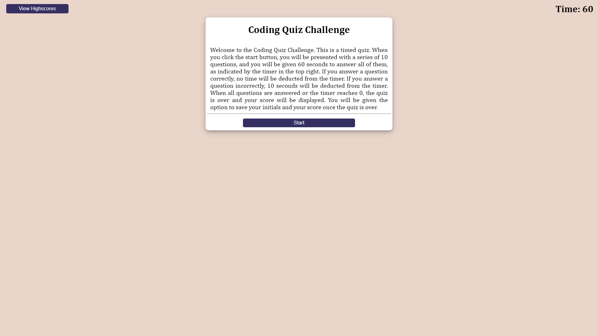
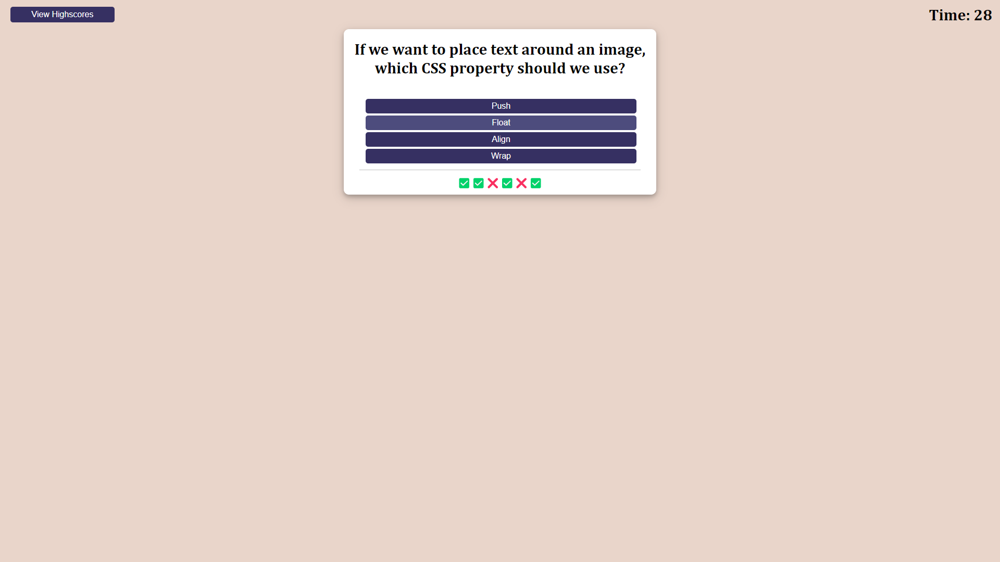
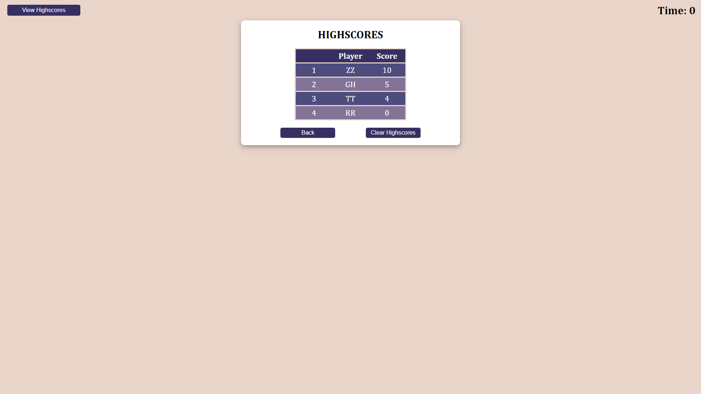

# Code Quiz
> By Richard Zhang

## Description

- The motivation behind this project was to encorporate all of the things I learned about JavaScript to create a dynamic page that responds to user inputs.
- I built this project to better understand how functions interact with each other and the HTML document, the logic of creating a quiz, and how a page becomes dynamic with the incorporation of JavaScript code. 
- This webpage can be used to practice an actual quiz that is timed. The quiz questions can be updated to change what the user is tested on. It's also a demonstration of how HTML, CSS, and JavaScript can be combined to create something dynamic.
- I learned a lot of things about JavaScript in particular through the creation of this project. I learned a couple new functions and how even built-in methods can be altered to perform a more specific task (such as the sort function to sort an array of objects). I learned how the hidden property can be used to show the user specific sections under certain conditions. I also expanded on my ability to use logic when creating something to perform a specific task.
-  This project incorporates a lot of custom functions that work together to create something cohesive enough to be called a quiz. I still think I have a long way to go, but I am satisfied with my creation. I think it's a good attempt at solving this challenge for an individual that is new to coding in general.

##  Link and Screenshots

> [Link to the live application](https://richardzhang01.github.io/code-quiz/)

