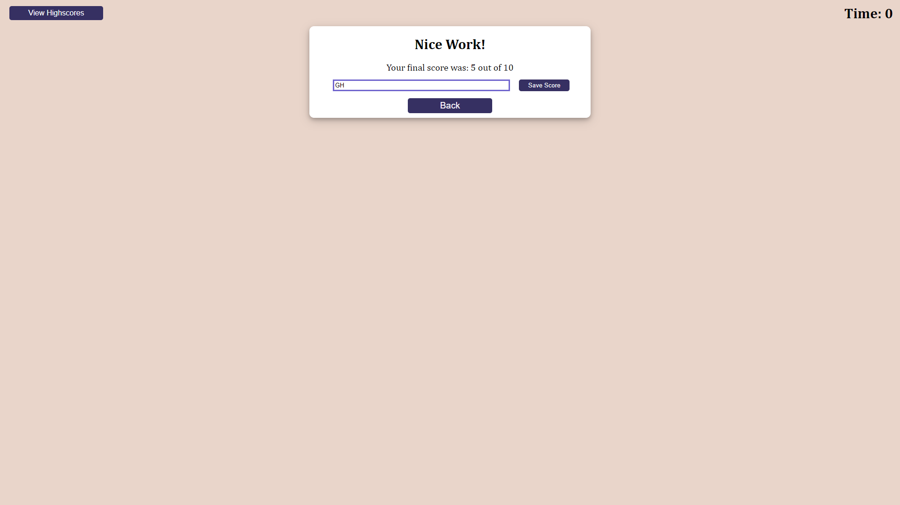

# Code Quiz
> By Richard Zhang

## Description

- The motivation behind this project was to encorporate all of the things I learned about JavaScript to create a dynamic page that responds to user inputs.
- I built this project to better understand how functions interact with each other and the HTML document, the logic of creating a quiz, and how a page becomes dynamic with the incorporation of JavaScript code. 
- This webpage can be used to practice an actual quiz that is timed. The quiz questions can be updated to change what the user is tested on. It's also a demonstration of how HTML, CSS, and JavaScript can be combined to create something dynamic.
- I learned a lot of things about JavaScript in particular through the creation of this project.   
-  

##  Link and Screenshots

> [Link to the live application](https://richardzhang01.github.io/password-generator/)

